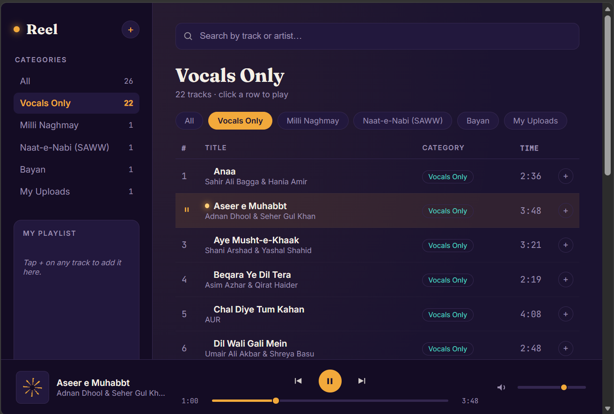

# 🎵 Reel — Music Player
A dark-themed, browser-based music player with category filtering, search, playlists, and local file upload support.

## Features
- 🎧 Play, pause, skip, and seek through tracks
- 🔍 Live search by track title or artist
- 🗂️ Category filters — Vocals Only, Milli Naghmay, Naat-e-Nabi, Bayan
- ➕ Build a custom playlist from any track
- 📁 Upload your own audio files from your PC
- 🔊 Volume control with mute toggle
- 🌀 Spinning reel animation on the now-playing cover
- ✨ Pulsing indicator on the currently playing track
- 📱 Responsive layout for mobile and desktop

## Tech Stack
- HTML5
- CSS3 (custom properties, grid, animations)
- Vanilla JavaScript
- Web Audio API

## Project Structure
reel/
├── index.html
├── style.css
├── script.js
└── songs/

## Getting Started
1. Clone the repo
2. Add your audio files to the `songs/` folder
3. Open `index.html` in your browser
No build step, no dependencies — just open and play.

## Fonts
- Fraunces — headings
- Inter — body text
- JetBrains Mono — timestamps and counts

## Preview

## License
MIT